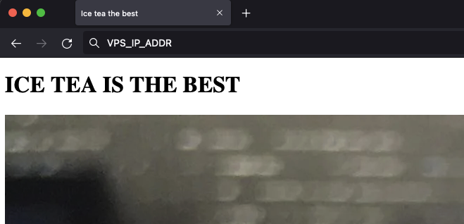
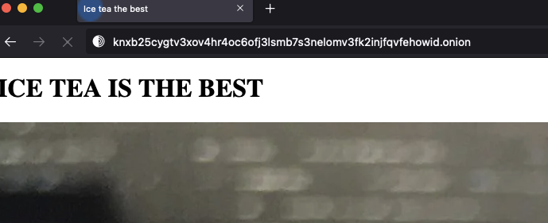
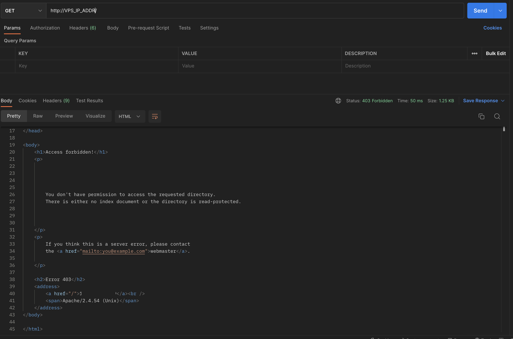
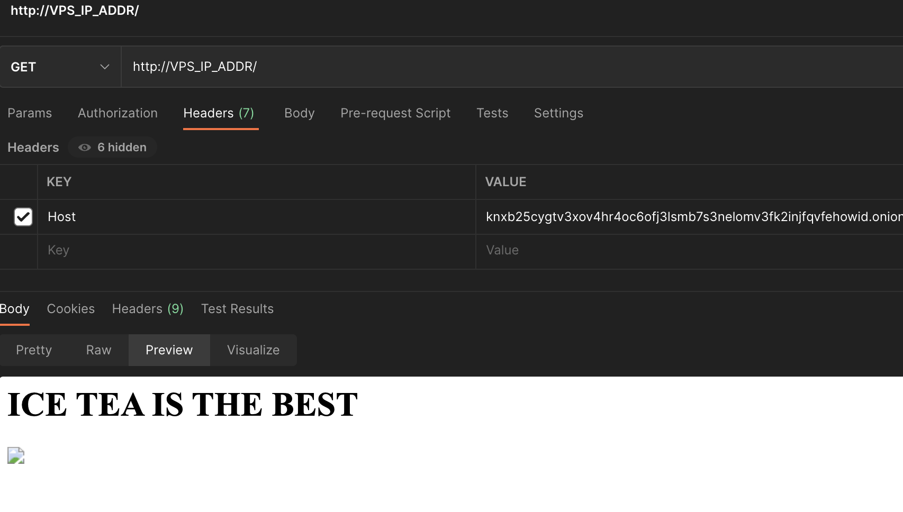
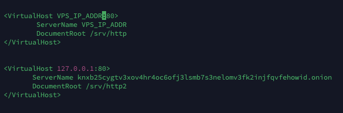

# Secure your website
Before we start, we will make a small POC example to demonstrate the interest of this system

## 01 - The Story

### The will of alice
Alice, a computer apprentice said it could be cool to be able to post pictures of her cute ice tea bottle on a Tor website. So she searches on github, falls on this repository and says that her can be cool to set up. So she starts the configurations

### Configs
She buys a small first price vps to config her tor website on it.

Simple config: 
```md
<VirtualHost *:80>

        ServerName VPS_IP_ADDR
        DocumentRoot /srv/http

</VirtualHost>
```
And tok: 



Website is now available on internet with the VPS ip !

Then it soothes the tuto to generate a website on tor

### Tor website
It has therefore generated a website that is not customised, don the onion url and the following: 

```
http://knxb25cygtv3xov4hr4oc6ofj3lsmb7s3nelomv3fk2injfqvfehowid.onion/
```

URL it took to delete at the end of POC



### Hacking
And now she’s trying to hack into her lovely website. And guess what ? VPS_IP_ADDR website is now off :) that is the good part.



OK ok ok ok now we are going to have fun. Simply add a header to a request on the ip address to access the site that is supposed to be "anonymous". This is a small problem.



# 01 - How to patch ?


force tor website config to listen on 127.0.0.1 and also set the servername for your website

```
<VirtualHost VPS_IP_ADDR:80>
        ServerName VPS_IP_ADDR
        DocumentRoot /srv/http
</VirtualHost>


<VirtualHost 127.0.0.1:80>
       ServerName knxb25cygtv3xov4hr4oc6ofj3lsmb7s3nelomv3fk2injfqvfehowid.onion
       DocumentRoot /srv/http2
</VirtualHost>
```